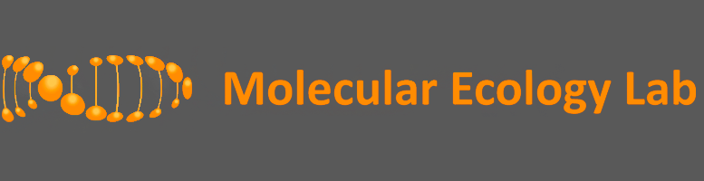
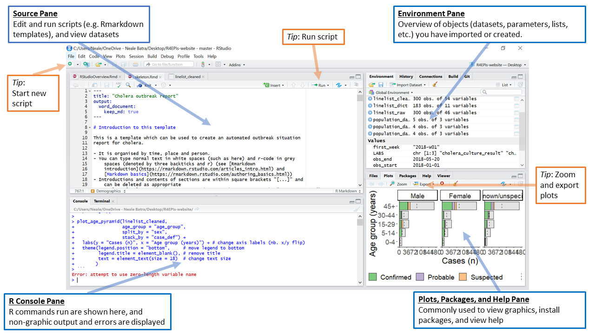
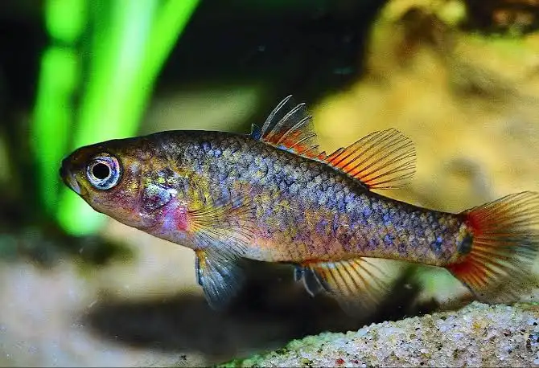
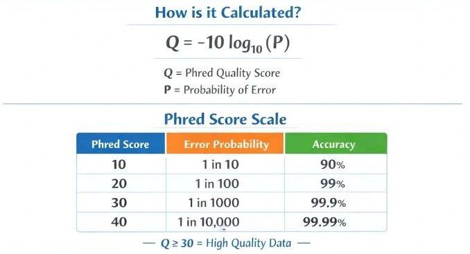
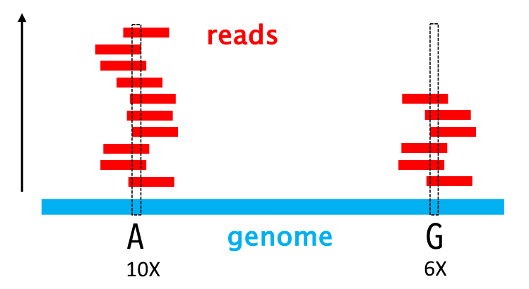
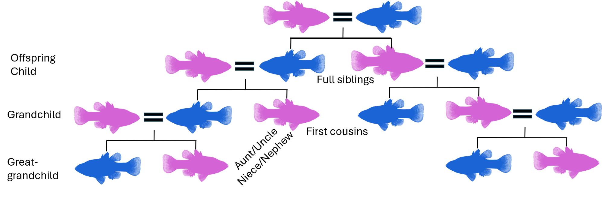

<style>
.session-divider {
  font-size: 2.5em;
  font-weight: 700;
  border-top: 3px solid #333;
  padding: 0.3em 0;
  margin: 1.5em 0;
}
</style>


::: {layout-ncol=2}
{width=600}

{width=200}
:::

::: {.session-divider}
Session 1
:::


## Overview

This lab walks through a typical population-genomics quality-control (QC)
and relatedness workflow, starting from a VCF (Variant Call Format) file of
SNP genotypes prodcunt of a ddRAD appraoch.

::: {.callout-note}
## Learning objectives
By the end of this lab you should be able to:

- Explain why SNP- and sample-level QC matters before downstream analysis
- Interpret QUAL, sequencing depth (DP), and missingness metrics, and
  identify samples/loci that may need filtering
- Calculate and interpret observed/expected heterozygosity and the
  inbreeding coefficient (F~IS~), both per locus and per individual
- Calculate and interpret relatedness and kinship coefficients
  in terms of degree of relationship
- Use pairwise kinship to select 3 southern pygmyperch breeding groups
  that minimise relatedness, and explain why this matters for captive
  breeding and reintroduction programs
:::

The workflow covers:

1. RStudio, package setup, and basic R commands
2. General SNP-level quality control (QUAL, depth, missingness)
3. Basic diversity statistics (H~O~, H~E~, F~IS~)
4. Individual heterozygosity and inbreeding
5. Pairwise relatedness and kinship
6. Network visualization of relatedness
7. Selecting low-relatedness breeding groups with `swingeR`

### Download lab material

All course materials (this document's source, example data, and the
`swingeR` package) are hosted here:

[Yuma GitHub — BIOL3722 Lab](https://github.com/Yuma248/Captive-management-and-restoration-genetics-series-2026)

<https://yuma248.github.io/Captive-management-and-restoration-genetics-series-2026/>


## RStudio Setup {#sec-setup}

{fig-align="center" width=50%}

### The four panels

1. **Source pane** (top-left): the text editor where you write and save
   scripts (`.R`) or documents (`.qmd`). Code here doesn't run until you
   send it to the console — but it's the only place your work is actually
   saved.
2. **Console pane** (bottom-left): where R code is actually executed. You
   can type commands directly here for quick tests, but anything typed
   only in the console is **not saved** when you close R. Non-graphical
   output and error messages appear here.
3. **Environment pane** (top-right): shows the objects (datasets,
   variables, functions) currently loaded in your session, plus a
   **History** tab of every command you've run.
4. **Output pane** (bottom-right): several tabs — **Files** (your
   working directory), **Plots** (rendered visualisations), **Packages**
   (installed/loaded add-ons), and **Help** (R documentation).

{#fig-rstudio-layout}

::: {.callout-tip}
## New to RStudio?
Two beginner-friendly primers if you want more detail before continuing:

- [Getting started with RStudio](https://www.dataquest.io/blog/tutorial-getting-started-with-r-and-rstudio/)
- [RStudio basics](https://sahirbhatnagar.com/EPIB607/basics.html)
:::

### Basic commands

Create a new folder on your machine, e.g.:

```{r}
#| label: mkdir
#| eval: false
myfolder<-"U:/Documents/BIOL3722_2026/"
if (!dir.exists(myfolder)) {
  dir.create(myfolder)
}
```

Set your working directory to the folder we just created, so relative
file paths (used throughout this document) resolve correctly.

```{r}
#| label: workingdir
#| eval: false

getwd()
setwd("U:/Documents/BIOL3722_2026/")
```

Now download the input files needed for this lab.


```{r}
#| label: download-inputs
#| eval: false

inputfiles <- c("SPBRsimulated.vcf.gz", "SPBRmeta.txt")

YumaGH <- "https://raw.githubusercontent.com/Yuma248/Captive-management-and-restoration-genetics-series-2026/main/data/"

for (i in inputfiles) {
  fullpath <- paste0(YumaGH, i)
  download.file(fullpath, destfile = i, mode = "wb")
}
```

Confirm the files downloaded correctly:

```{r}
#| label: check-inputs

list.files()
```

### Install and load packages

::: {.callout-warning}
## Do not run this chunk now
The following commands install all the R package we are using for this lab, these packages are already installed on the lab computers. So, no need to run this part now,
but if you need to working on your own computer, run the block below **once**.
:::

The `swingeR` package (used for breeding-group selection) is
available here: 

[swingeR releases](https://github.com/Yuma248/Captive-management-and-restoration-genetics-series-2026).

Described here:

[Sandoval-Castillo et al 2017](https://molecularecology.flinders.edu.au/wp-content/uploads/2021/11/169_SWINGER.pdf)

```{r}
#| label: packages
#| eval: false

if (!requireNamespace("BiocManager", quietly = TRUE)) install.packages("BiocManager")

pkgs <- c("vcfR", "ggplot2", "dplyr", "tidyr", "patchwork", "reshape2",
          "tidyverse", "vegan", "dartR.base", "dartR.popgen", "adegenet",
          "SNPRelate", "gdsfmt", "hierfstat", "visNetwork")

for (p in pkgs) {
  if (!requireNamespace(p, quietly = TRUE)) {
    if (p %in% c("vcfR", "SNPRelate", "gdsfmt")) {
      BiocManager::install(p)
    } else {
      install.packages(p)
    }
  }
}

# swingeR: install from a local .tar.gz (adjust the path to wherever you saved it)
install.packages("swingeR_0.4.0.tar.gz", repos = NULL, type = "source")
```

Now load everything for the session:

```{r}
#| label: library-load

library(swingeR)
library(vcfR)
library(ggplot2)
library(dplyr)
library(dartR.base)
library(dartR.popgen)
library(tidyverse)
library(vegan)
library(tidyr)
library(patchwork)
library(reshape2)
library(SNPRelate)
library(hierfstat)
library(visNetwork)
```

### Load the VCF and metadata

Declare file paths once, so they're easy to change and don't need to be
repeated throughout the document.

```{r}
#| label: paths

vcffile  <- "SPBR_50_6328.vcf.gz"
gdsfile  <- "SPBR_50_6328.gds"
metafile <- "SPBRmeta.txt"
```

We need two files:

1. **A VCF** summarising all variants detected and characterised for
   pygmy perch (see [Marshall et al. 2021](https://molecularecology.flinders.edu.au/wp-content/uploads/2022/03/237_Long_COBIO.pdf))
2. **Metadata** with relevant sample information (ID, sex, population,
   location, etc.)

```{r}
#| label: load-data

vcf  <- read.vcfR(vcffile, verbose = FALSE)
meta <- read.table(metafile, header = TRUE, sep = "\t")
vcf
```

::: {.callout-tip}
## Data set description
This dataset contains genome-wide variants (SNPS) generated using double-digest
Restriction-site Associated DNA sequencing (**ddRAD-seq**) from 50 **Southern Pygmy Perch**
(*Nannoperca australis*) individuals sampled as part of the MELFU Flinders University captive
breeding program. After quality filtering, the dataset includes 6,328 high-quality genetic variants
distributed across 24 chromosomes and 6 unmapped scaffolds. This dataset provides a robust representation
of genome-wide genetic variation and is suitable for estimating relatedness, inbreeding, and genetic
diversity to inform breeding management decisions.

{fig-align="center" width=50%}

:::


## General QC checks

High-throughput sequencing enables detection and characterisation of
millions of sequence variants, most commonly single nucleotide
polymorphisms (SNPs). After variant discovery, quality control (QC) is
essential to ensure genotype calls are accurate and reliable — poor QC
increases the risk of spurious results in every downstream analysis that
follows.

We'll check four things:

1. Variant quality score (QUAL)
2. Sequencing depth (DP)
3. Missing data
4. Distribution of variants across the genome

### QUAL score distribution

**QUAL** is a Phred-scaled score representing the site-level confidence
that a variant genuinely exists at that position (as opposed to being a
sequencing/mapping artefact) — higher QUAL means greater confidence.
Phred scaling is logarithmic: QUAL = 20 corresponds to a 1% probability
the call is wrong, QUAL = 30 corresponds to 0.1%, and so on.

{#fig-phred}

```{r}
#| label: qual-dist

ourSNPs <- vcf2df(vcf)

qd_df <- data.frame(QD = ourSNPs$QUAL_num[is.finite(ourSNPs$QUAL_num)])

ggplot(qd_df, aes(x = QD)) +
  geom_histogram(bins = 100, fill = "#8172B2", colour = "white") +
  xlim(0, 5000) +
  labs(x = "QUAL", y = "Count") +
  theme_bw(base_size = 12)
```

Quality scaled by sequencing depth (QUAL / DP) is often a more informative
filter than raw QUAL alone, since QUAL naturally increases with depth even
when per-read support for the variant hasn't improved:

```{r}
#| label: qual-per-dp

ourSNPs$QUAL_per_dp <- ourSNPs$QUAL_num / ourSNPs$DP_raw

qd_df <- data.frame(QD = ourSNPs$QUAL_per_dp[is.finite(ourSNPs$QUAL_per_dp)])

ggplot(qd_df, aes(x = QD)) +
  geom_histogram(bins = 100, fill = "#8172B2", colour = "white") +
  geom_vline(xintercept = 0.2, linetype = "dashed", colour = "red") +
  xlim(0, 3) +
  labs(x = "QUAL / DP (quality / depth of coverage)", y = "Count") +
  theme_bw(base_size = 12)
```

### Sequencing depth (DP) distribution

**DP** is the total number of sequencing reads covering a genomic
position. Higher depth generally gives more confidence in a genotype call,
since it's supported by more independent reads, but very high depth at a
locus can also indicate a mapping artefact (e.g. reads from a duplicated
genomic region collapsing onto one location).

{#fig-dp}

```{r}
#| label: dp-dist

dp_df <- data.frame(DP = ourSNPs$DP_raw)

ggplot(dp_df, aes(x = DP)) +
  geom_histogram(bins = 100, fill = "#8172B2", colour = "white") +
  labs(title = "Read Depth (DP) Distribution", x = "Depth", y = "Count") +
  theme_bw(base_size = 13)
```

Depth per genotype call, trimmed to the 99th percentile (to avoid extreme
outliers dominating the plot), with the mean and mean ± 2 SD marked as
example filtering thresholds:

```{r}
#| label: dp-per-genotype

dp_per_genotype <- ourSNPs$DP_raw / ourSNPs$n_genotypes
dp_df <- data.frame(DP = dp_per_genotype)
dp_df <- dp_df[!is.na(dp_df$DP) & dp_df$DP < quantile(dp_df$DP, 0.99, na.rm = TRUE), ,
               drop = FALSE]

dp_mean    <- mean(dp_df$DP, na.rm = TRUE)
dp_mean2sd <- dp_mean + 3 * sd(dp_df$DP, na.rm = TRUE)

ggplot(dp_df, aes(x = DP)) +
  geom_histogram(bins = 100, fill = "#8172B2", colour = "white") +
  geom_vline(xintercept = c(6, dp_mean, 85), linetype = "dashed",
             colour = c("red", "orange", "red")) +
  labs(title = "Read Depth (DP) Distribution", x = "Depth", y = "Count") +
  theme_bw(base_size = 13)
```

### Missing data

A genotype is "missing" when there weren't enough good-quality reads to
confidently call it. Common causes include degraded DNA, low sequencing
depth, or loci that are inherently difficult to genotype (e.g. paralogous
regions, primer/probe mismatch in target-capture or RAD data).

Per locus:

```{r}
#| label: missing-per-locus

miss_var_df <- data.frame(Miss_pct = ourSNPs$missing)

ggplot(miss_var_df, aes(x = Miss_pct)) +
  geom_histogram(bins = 50, fill = "#CCB974", colour = "white") +
  geom_vline(xintercept = 20, linetype = "dashed", colour = "red") +
  labs(title = "Missing Data per Variant", x = "Missing Genotypes (%)",
       y = "Number of Variants") +
  theme_bw(base_size = 13)
```

Per sample:

```{r}
#| label: missing-per-sample

ourInd <- vcf2inddf(vcf)

miss_df <- data.frame(Sample = ourInd$ID, Missing_pct = ourInd$miss_pct)

ggplot(miss_df, aes(x = reorder(Sample, -Missing_pct), y = Missing_pct)) +
  geom_col(fill = "#8172B2") +
  geom_hline(yintercept = 20, linetype = "dashed", colour = "red") +
  labs(title = "Missing Genotypes per Sample", x = "Sample", y = "Missing (%)") +
  theme_bw(base_size = 13) +
  theme(axis.text.x = element_text(angle = 45, hjust = 1, size = 8))
```

::: {.callout-tip}
## Interpreting missingness
Samples or loci above your chosen threshold (here, 20%, marked with the
dashed line) are usually flagged for removal before downstream analysis.
High missingness at a *locus* often points to a technical problem with
that marker across the whole dataset; high missingness in one *individual*
more often points to a sample-quality problem (degraded DNA, low library
yield) specific to that sample.
:::

### Per-chromosome variant count

Reduced-representation data (e.g. RAD-seq/ddRAD) is expected to be
distributed fairly evenly across the genome rather than concentrated in
one or two regions — a strong departure from this can indicate reference
assembly issues, repetitive/paralogous regions, or a biased restriction
enzyme cut-site distribution.

```{r}
#| label: per-chrom

chr_df <- ourSNPs %>%
  count(CHROM) %>%
  arrange(as.numeric(gsub("scaffold_", "", CHROM))) %>%
  mutate(CHROM = factor(CHROM, levels = CHROM))

ggplot(chr_df, aes(x = CHROM, y = n, fill = CHROM)) +
  geom_col(show.legend = FALSE) +
  labs(title = "Variants per Chromosome", x = "Chromosome", y = "Count") +
  theme_bw(base_size = 13) +
  theme(axis.text.x = element_text(angle = 45, hjust = 1))
```

## Basic diversity statistics

Genetic diversity within a population underpins its capacity to respond to
environmental change, disease, and other selective pressures, and therefore it's a
central concept in both evolutionary biology and conservation genetics.
Three standard measures:

- Allelic diversity
- Nucleotide diveristy

- **Observed heterozygosity (H~O~)**: the proportion of individuals
  that are heterozygous at a locus, directly counted from the genotypes.
- **Expected heterozygosity (H~E~)**: the heterozygosity
  *expected* under Hardy-Weinberg equilibrium, calculated from allele
  frequencies. `hierfstat::basic.stats()` reports this as `Hs`.
- **Inbreeding coefficient (F~IS~)**: the standardised difference
  between expected and observed heterozygosity:
  $$F_{IS} = 1 - \frac{H_O}{H_E}$$
  Positive F~IS~ (heterozygote deficit) can indicate inbreeding,
  assortative mating, or population substructure (a Wahlund effect).
  Negative F~IS~ (heterozygote excess) can indicate outbreeding,
  disassortative mating, or balancing selection.

```{r}
#| label: basic-diversity

gi <- vcfR2genind(vcf)
pop(gi) <- as.factor(rep("pop1", nInd(gi)))

stats <- basic.stats(gi)
stats$overall[c("Ho", "Hs", "Fis")]
```

### Per-locus heterozygosity and F~IS~

```{r}
#| label: perloc-he

ggplot(stats$perloc, aes(x = Hs)) +
  geom_histogram(bins = 20, fill = "steelblue", colour = "white") +
  geom_vline(xintercept = 0.75, linetype = "dashed", colour = "red") +
  labs(title = "Expected heterozygosity per locus", x = "He",
       y = "Number of Variants") +
  theme_bw(base_size = 13)
```

```{r}
#| label: perloc-ho

ggplot(stats$perloc, aes(x = Ho)) +
  geom_histogram(bins = 20, fill = "steelblue", colour = "white") +
  geom_vline(xintercept = 0.75, linetype = "dashed", colour = "red") +
  labs(title = "Observed heterozygosity per locus", x = "Ho",
       y = "Number of Variants") +
  theme_bw(base_size = 13)
```

```{r}
#| label: perloc-fis

ggplot(stats$perloc, aes(x = Fis)) +
  geom_histogram(bins = 20, fill = "steelblue", colour = "white") +
  geom_vline(xintercept = 0.5, linetype = "dashed", colour = "red") +
  labs(title = "Inbreeding index per locus (Fis)", x = "Fis",
       y = "Number of Variants") +
  theme_bw(base_size = 13)
```

::: {.callout-tip}
## Interpreting per-locus outliers
A handful of loci with extreme H~O~, H~E~, or F~IS~ values relative to
the rest of the genome is expected by chance. But loci that are *very*
far outliers are also often flagged as candidates for genotyping error
(e.g. null alleles causing spuriously high F~IS~) or for being under
selection, rather than reflecting neutral demographic processes alone —
worth keeping in mind if any of these loci turn out to matter for later
analyses.
:::

### Individual heterozygosity

```{r}
#| label: ind-het

df_ihe <- ourInd[order(ourInd$Ho), ]
df_ihe$ID <- factor(df_ihe$ID, levels = df_ihe$ID)

mean_ho <- mean(df_ihe$Ho, na.rm = TRUE)

ggplot(df_ihe, aes(x = ID, y = Ho)) +
  geom_col(fill = "steelblue", colour = "white") +
  geom_hline(yintercept = mean_ho, colour = "tomato", linetype = "dashed",
             linewidth = 0.8) +
  annotate("text", x = nrow(df_ihe), y = mean_ho * 1.05,
           label = paste("Mean =", round(mean_ho, 3)),
           colour = "tomato", hjust = 1, size = 3.5) +
  labs(title = "Observed heterozygosity per individual", x = "Sample",
       y = "Ho (proportion of heterozygous loci)") +
  theme_classic() +
  theme(axis.text.x = element_text(angle = 90, vjust = 0.5, hjust = 1, size = 8),
        plot.title = element_text(hjust = 0.5, face = "bold"))
```

::: {.callout-tip}
## Interpreting individual heterozygosity
Individuals well **below** the population mean may be inbred (offspring
of related parents) or come from a small/isolated subpopulation.
Individuals well **above** the mean can indicate recent admixture between
distinct genetic groups, or occasionally sample contamination, always
worth cross-checking against the individual inbreeding coefficient below
before drawing conclusions.
:::


::: {.session-divider}
Session 2
:::

```{r}
#| label: load-second
#| eval: false
#| echo: !expr params$session >= 2

setwd("U:/Documents/BIOL3722_2026/")

library(swingeR)
library(vcfR)
library(ggplot2)
library(dplyr)
library(dartR.base)
library(dartR.popgen)
library(tidyverse)
library(vegan)
library(tidyr)
library(patchwork)
library(reshape2)
library(SNPRelate)
library(hierfstat)
library(visNetwork)

vcffile  <- "SPBR_50_6328.vcf.gz"
gdsfile  <- "SPBR_50_6328.gds"
metafile <- "SPBRmeta.txt"
vcf  <- read.vcfR(vcffile, verbose = FALSE)
meta <- read.table(metafile, header = TRUE, sep = "\t")
```

## Individual inbreeding coefficient

While F~IS~ above summarises heterozygote deficit at *population* level,
we can also estimate an inbreeding coefficient (F) for each *individual*.
This measures the proportion of an individual's genome that is more homozygous
than expected because the two copies of a gene are likely to have been inherited
from a common ancestor (*identical by descent*). In other words, it indicates the
extent to which an individual has increased homozygosity due to mating between
related individuals (e.g., related parents).

```{r}
#| label: vcf2gds
#| echo: !expr params$session >= 2

showfile.gds(closeall = TRUE)
#snpgdsVCF2GDS(vcffile, gdsfile, method = "biallelic.only")
genofile <- snpgdsOpen(gdsfile)
snpgdsSummary(gdsfile)
```

```{r}
#| label: filter-chroms
#| echo: !expr params$session >= 2


snp_id <- read.gdsn(index.gdsn(genofile, "snp.id"))
chrom  <- read.gdsn(index.gdsn(genofile, "snp.chromosome"))
chrom_keep <- paste0("scaffold_", 1:24)
snps_chrom <- snp_id[chrom %in% chrom_keep]
cat("SNPs on first 24 scaffolds/chromosomes:", length(snps_chrom), "\n")
```

```{r}
#| label: individual-F
#| echo: !expr params$session >= 2


ibd <- snpgdsIndInb(genofile, snp.id = snps_chrom, autosome.only = FALSE)
ibd_df <- data.frame(ID = ibd$sample.id, F = ibd$inbreeding)
ibd_df <- ibd_df[order(ibd_df$F), ]

ggplot(ibd_df, aes(x = reorder(ID, F), y = F)) +
  geom_col(fill = "steelblue", colour = "white") +
  geom_hline(yintercept = 0, colour = "tomato", linetype = "dashed") +
  labs(title = "Individual inbreeding coefficient (F)", x = "Sample", y = "F") +
  theme_classic() +
  theme(axis.text.x = element_text(angle = 90, vjust = 0.5, hjust = 1, size = 8),
        plot.title = element_text(hjust = 0.5, face = "bold"))
```

::: {.callout-tip}
## Interpreting individual inbreeding
Individuals **below** 0 are some how  outbred (offspring
of genetically very different parents) or come from different subpopulation.
Individuals **above** 0 indicate some level of inbreeding, values 
above 0.1 are consisten with recent inbreeding, while values around and about 0.25
are expected for offspring of full-sibling or parent-offspring mating
:::


## Pairwise relatedness and kinship

**Relatedness**: describes overall genetic similarity between two
individuals.
**Kinship**: specifically quantifies genetic similarity
attributable to shared recent ancestry, the kinship
coefficient (φ) is the probability that a randomly chosen allele from one
individual is identical by descent to a randomly chosen allele at the same
locus in the other individual.

This matters on both evolutionary and ecological contex, relatedness and kinship
underpin studies of kin selection, gene flow, demographic history,
reproductive and social behaviour, trait-based (heritability) analyses,
and, directly relevant to this lab, **the management of captive and
wild populations**, where minimising relatedness among breeding pairs
helps avoid inbreeding depression and preserve genetic diversity.

For more on the importance of relatedness on captive breeding programs:

[Attard et al 2016](https://molecularecology.flinders.edu.au/wp-content/uploads/2021/11/163_Reintro_COBI.pdf)

[Marshall et al 2022](https://molecularecology.flinders.edu.au/wp-content/uploads/2021/11/163_Reintro_COBI.pdf)


We'll calculate two different estimators, since they make different
assumptions and are useful to cross-check against each other:

- **Relatedness** (`QGrel()`), based on Queller & Goodnight 1989, 
  that uses a "method of moments" approach to calculate
  the genetic similarity between pair of individual, relative to the allel frequency of 
  a reference population. Range (0-1)
- **Kinship** (`snpgdsIBDKING()`), based on the KING-robust algorithm, 
  that uses a "allel dosage" approach and doesn't assume Hardy-Weinberg equilibrium in a
  reference populatio, making it robust to population substructure and a reasonable option when your
  study population's demographic history isn't well known. Range (-Inf-0.5)

{#fig-kinship-pygmyperch}

::: {.callout-note}
## Standard kinship coefficient (φ) thresholds
| φ (expected) | Relationship | Degree |
|---|---|---|
| ~0.5 | Self / identical twins / duplicate sample | - |
| ~0.25 | Parent-offspring, full siblings | 1st degree |
| ~0.125 | Half-siblings, grandparent-grandchild, aunt/uncle-niece/nephew | 2nd degree |
| ~0.0625 | First cousins | 3rd degree |
| ~0 | Unrelated | — |

Real pairwise estimates scatter around these expected values due to the
randomness of Mendelian segregation and (for small marker panels)
estimation noise — treat these as rough category centres, not hard
boundaries.
:::


```{r}
#| label: relatedness-beta
#| echo: !expr params$session >= 2

rel_matrix<-QGrel(vcf)

rel_df <- as.data.frame(as.table(rel_matrix))
colnames(rel_df) <- c("from", "to", "relatedness")
rel_df <- rel_df %>% filter(as.character(from) != as.character(to))

summary(rel_df$relatedness)
```
### Visualizing the relatedness distribution
Ok, let see the distribution of the relatedness between out Pygmyperch
```{r}
#| label: relatedness-plot
#| echo: !expr params$session >= 2
ggplot(rel_df, aes(x = relatedness)) +
  geom_histogram(bins = 100, fill = "steelblue", colour = "white") +
  labs(title = "Pairwise Relatedness", x = "Relatedness", y = "Frequency") +
  theme_bw(base_size = 13)
```

Now let check the same for the Kinship

```{r}
#| label: king
#| echo: !expr params$session >= 2

king <- snpgdsIBDKING(genofile, snp.id = snps_chrom, type = "KING-robust",
                       autosome.only = FALSE, verbose = TRUE)
kinship_matrix <- king$kinship
rownames(kinship_matrix) <- king$sample.id
colnames(kinship_matrix) <- king$sample.id

kinship_df <- as.data.frame(as.table(kinship_matrix))
colnames(kinship_df) <- c("from", "to", "kinship")
kinship_df <- kinship_df %>% filter(as.character(from) != as.character(to))

summary(kinship_df$kinship)
```

### Visualizing the kinship distribution

```{r}
#| label: kinship-plot
#| echo: !expr params$session >= 2


KP<-ggplot(kinship_df, aes(x = kinship)) +
  geom_histogram(bins = 100, fill = "steelblue", colour = "white") +
  labs(title = "Pairwise Kinship", x = "Kinship", y = "Frequency") +
  theme_bw(base_size = 13)

KP
```
::: {.callout-note collapse="true"}
## Kinship distribution plot

```{r}
#| label: hidden-kinship-plot
#| echo: !expr params$session >= 2

kinship_labels <- data.frame(
  x = c(0, 0.0625, 0.125, 0.25, 0.5),
  label = c("Unrelated", "3rd degree", "2nd degree", "1st degree", "Clones")
)


KP +
  geom_vline(xintercept = kinship_labels$x, linetype = "dashed",
             colour = "red", linewidth = 0.8) +
  geom_text(data = kinship_labels, aes(x = x, y = Inf, label = label),
            inherit.aes = FALSE, colour = "tomato", hjust = 1.2, vjust = 1.5,
            angle = 90, size = 4)
```
:::

::: {.callout-important}
## Discussion
Do most pairs in this dataset cluster near "unrelated", or is there a
long tail toward higher kinship? What might a long tail toward high
kinship suggest about how this sample was collected (e.g. sampling
multiple individuals from the same family group or a small, isolated
population)?
:::

### Network visualization of kinship

A network view makes it easier to spot clusters of closely related
individuals and identify good candidate pairs/groups for breeding (i.e.
the *least* related individuals) at a glance, compared to scanning a
kinship matrix or table directly.

```{r}
#| label: network
#| echo: !expr params$session >= 2

net <- networkY(kinship_df, meta, td = 0.1, method = "fixed")
net
```

```{r}
#| label: network-strict
#| echo: !expr params$session >= 2
net <-networkY(kinship_df, meta, td=0.1, method = 'relative')
net
```

```{r}
#| label: network-save
#| eval: false
#| echo: !expr params$session >= 2

visSave(net, "kinship_network.html")
```

## Selecting low-relatedness breeding groups

In captive breeding and reintroduction programs, pairing or grouping
closely related individuals risks inbreeding depression, reduced
fitness, fertility, and disease resistance in offspring, and accelerates
loss of genetic diversity across generations. The goal here is the
opposite: select breeding groups that minimise relatedness among their
members, retaining as much of the population's genetic diversity as
possible.

`swingeR()` (from the `swingeR` package) automates this: given pairwise
kinship and per-individual metadata (sex, internal relatedness), it
searches for sets of non-overlapping breeding groups that satisfy
relatedness thresholds you specify.

```{r}
#| label: combine-metadata
#| echo: !expr params$session >= 2

combined_df <- merge(meta, ibd_df, by = "ID")
combined_df
```

```{r}
#| label: breeding-groups
#| eval: false
#| echo: !expr params$session >= 2

results <- swingeR(
  kinship_df = kinship_df,
  info_df    = combined_df,
  n_groups   = 3,
  n_females  = 2,
  n_males    = 3
)
```

With tighter thresholds, requiring lower internal relatedness and
allowing only slightly negative (i.e. more distantly related than average)
pairwise kinship within each group:

```{r}
#| label: breeding-groups-strict
#| eval: !expr params$session >= 2
#| echo: !expr params$session >= 2

results_strict <- swingeR(
  kinship_df = kinship_df,
  info_df    = combined_df,
  n_groups   = 3,
  n_females  = 2,
  n_males    = 3,
  max_ir_f   = 0.0,
  max_ir_m   = 0.0,
  max_pair_rel_f    = -0.01,
  max_pair_rel_m    = -0.01,
  max_pair_rel = -0.01,
  max_group_avg_rel = -0.03,
  max_combo_avg_rel = -0.045
)
print_breeding_groups(results_strict)
```

::: {.callout-important}
## Discussion / try it yourself
1. Try now with the relatedness matrix instead of the kinship.
2. Compare the two results above. Did tightening the thresholds change
   which individuals were selected, or did it fail to find a valid
   combination at all? What would you do in practice if no combination
   satisfies your desired thresholds?
3. Try changing `n_females`/`n_males`/`n_groups` — how does group size
   affect how easy it is to find a low-relatedness combination?
4. In a real breeding program, what other factors (beyond relatedness)
   might you want `swingeR` to account for, and how might you incorporate
   them?
:::

## Summary and further reading

- [Attard et al. (2016).](https://molecularecology.flinders.edu.au/wp-content/uploads/2021/11/163_Reintro_COBI.pdf)
- [Marshall et al. (2021).](https://molecularecology.flinders.edu.au/wp-content/uploads/2022/03/237_Long_COBIO.pdf)
- [Sandoval-Castillo et al. (2017).](https://molecularecology.flinders.edu.au/wp-content/uploads/2021/11/169_SWINGER.pdf)
- `vcfR`, `SNPRelate`, `hierfstat`, and `dartR` documentation are the best
  next stop for parameter details on any function used in this lab
- The `swingeR` package repository (linked above) documents all
  `swingeR()` parameters in full
